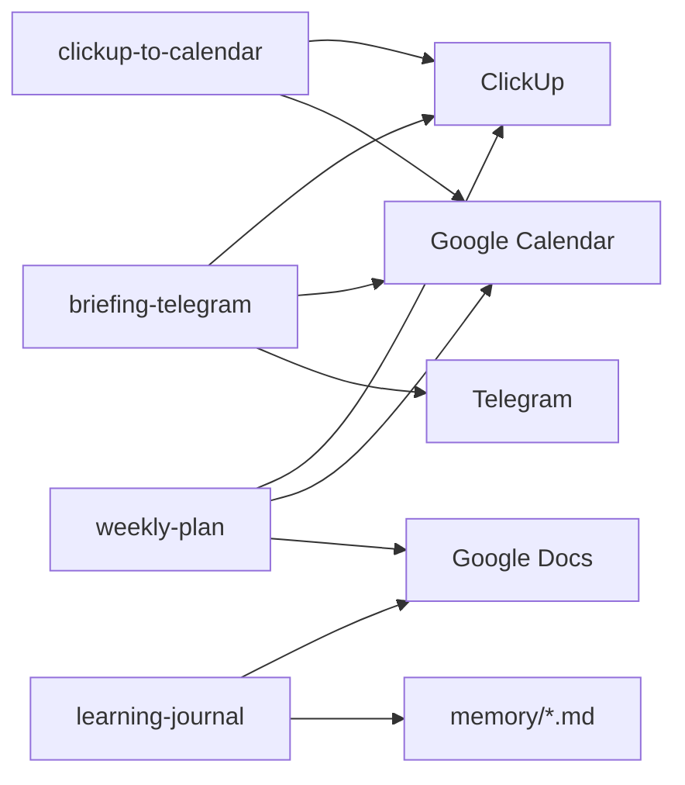

# SKILLS_DESIGN.md — Diseño de skills para agentclaw

Skills elegidas: las 4 propuestas en el plan, priorizadas por reutilización y herramientas ya activas (ClickUp, Calendar, Drive, Telegram).

---

## 1. ClickUp → bloques en Calendar

### ¿Qué hace esta skill?

Lee tareas pendientes de ClickUp y crea bloques de tiempo en Google Calendar para las que aún no tienen hora reservada.

### ¿Qué input necesita el agente?

| Fuente | Qué aporta |
|---|---|
| **Usuario** | Lista o espacio de ClickUp (ej. "mis pendientes de esta semana"), preferencias de horario (mañanas para deep work, tardes para reuniones), duración por tarea si la conoce |
| **USER.md** | Timezone México (UTC-6), rol (diseño + marketing + AI Engineering) |
| **TOOLS.md** | Herramientas Composio: `CLICKUP_GET_TASKS`, `GOOGLECALENDAR_FIND_FREE_SLOTS`, `GOOGLECALENDAR_CREATE_EVENT`, `GOOGLECALENDAR_FIND_EVENT` |
| **AGENTS.md** | Pedir confirmación antes de crear eventos en calendario externo |

**Formato de input:** lenguaje natural o comando corto: `"bloquea mis tareas de ClickUp"` / `"agenda pendientes de la lista X"`.

### ¿Cómo es un buen output?

- **Formato:** resumen en chat con tabla/lista de tareas → slots propuestos → eventos creados (o preview si pide confirmación).
- **Destino:** eventos en Google Calendar (`primary`, timezone `America/Mexico_City`).
- **Cada evento incluye:** título = nombre de la tarea, duración realista (30–120 min según prioridad), descripción con link a ClickUp (`https://app.clickup.com/t/{task_id}`).
- **Éxito:** al abrir Calendar se ven bloques alineados a pendientes de ClickUp, sin solapar eventos existentes.

---

## 2. Briefing matutino por Telegram

### ¿Qué hace esta skill?

Resume el día en un mensaje corto: eventos de Calendar, tareas prioritarias de ClickUp, noticias de IA (modelos, desarrollo, imágenes, ads, agentes) y (opcional) partidos MLB.

### ¿Qué input necesita el agente?

| Fuente | Qué aporta |
|---|---|
| **Usuario** | Activación: `"briefing"`, `"qué tengo hoy"`, cron/heartbeat matutino |
| **USER.md** | Timezone, intereses (MLB, AI Engineering, marketing, diseño) |
| **TOOLS.md** | Calendar, ClickUp, SeatGeek, `COMPOSIO_SEARCH_WEB`; script `openclaw-connection/mlb.py` |
| **skills/telegram-messaging** | Envío del mensaje al chat de Carlos |
| **HEARTBEAT.md** | Puede incluirse como tarea periódica |

**Formato de input:** sin argumentos (usa "hoy") o fecha explícita.

### ¿Cómo es un buen output?

- **Formato:** mensaje Telegram con bullets, sin tablas Markdown, tono directo (SOUL.md).
- **Secciones:** 📅 Calendario (próximas 24h) → 📋 ClickUp (top 3–5) → 🤖 IA (3–5 noticias: modelos, dev, imágenes, ads, agentes) → ⚾ MLB (solo si hay juegos).
- **Destino:** Telegram DM de Carlos (`chat_id` de la sesión activa o configurado).
- **Éxito:** Carlos lee el mensaje en el móvil, sabe qué hacer hoy y se entera de lo relevante en IA sin abrir otras apps.

---

## 3. Diario de aprendizaje (AI + inglés)

### ¿Qué hace esta skill?

Toma bullets crudos de "qué aprendí hoy" y añade una entrada estructurada al diario de aprendizaje en Google Docs y en `memory/YYYY-MM-DD.md`.

### ¿Qué input necesita el agente?

| Fuente | Qué aporta |
|---|---|
| **Usuario** | 2–5 puntos en español o inglés sobre lo aprendido (concepto, herramienta, error resuelto, vocabulario) |
| **USER.md** | Intereses: AI Engineering, Python, inglés, automatización |
| **TOOLS.md** | Google Drive/Docs vía Composio (`GOOGLEDRIVE_FIND_FILE`, `GOOGLEDOCS_*` vía búsqueda Composio) |
| **AGENTS.md** | Escribir a archivo = memoria persistente |

**Formato de input:** texto libre o lista con viñetas. Ejemplo: `"hoy aprendí: async en Python, qué es un MCP server, vocab: 'trade-off'"`.

**Config persistente (primera vez):** ID o nombre del Google Doc diario (guardar en `TOOLS.md` bajo sección Diario de Aprendizaje).

### ¿Cómo es un buen output?

- **Formato de entrada en Doc:**
  ```
  ## YYYY-MM-DD — [tema principal]
  **Qué aprendí:** ...
  **Cómo lo aplicaría:** ...
  **Vocabulario EN:** ... (si aplica)
  **Tags:** #ai-engineering #python
  ```
- **Destino:** append al Google Doc del diario + sección `## Aprendizaje` en `memory/YYYY-MM-DD.md`.
- **Éxito:** al abrir el Doc, la entrada del día está formateada y es buscable; la memoria local también quedó actualizada.

---

## 4. Plan de semana (objetivos → Doc + Calendar)

### ¿Qué hace esta skill?

Con objetivos y compromisos de la semana, genera un plan priorizado en Google Doc y crea 3–5 eventos clave en Calendar.

### ¿Qué input necesita el agente?

| Fuente | Qué aporta |
|---|---|
| **Usuario** | Lista de objetivos de la semana, restricciones ("martes no disponible"), enfoque (estudio / clientes / mixto) |
| **USER.md** | Rol, timezone, intereses |
| **TOOLS.md** | ClickUp (pendientes existentes), Calendar (eventos ya agendados), Drive/Docs |
| **AGENTS.md** | Confirmar antes de crear eventos |

**Formato de input:** lista de objetivos + opcional "incluye pendientes de ClickUp". Ejemplo: `"plan de semana: terminar módulo Python, entregar diseño VB, 3h de inglés"`.

**Config persistente:** carpeta o Doc base para planes semanales (guardar en `TOOLS.md`).

### ¿Cómo es un buen output?

- **Doc:** título `Plan Semana YYYY-Www`, secciones P1/P2/P3, bloques sugeridos por día, checklist al final.
- **Calendar:** 3–5 eventos para bloques críticos (deep work, entregas, estudio inglés) sin solapar lo existente.
- **Chat:** resumen con link al Doc + lista de eventos creados.
- **Éxito:** el lunes Carlos tiene plan escrito y bloques en el calendario listos para ejecutar.

---

## Dependencias entre skills



## Orden de implementación

1. `clickup-to-calendar` — mayor frecuencia diaria
2. `briefing-telegram` — complementa (1) cada mañana
3. `learning-journal` — captura al final del día
4. `weekly-plan` — una vez por semana (domingo o lunes)
